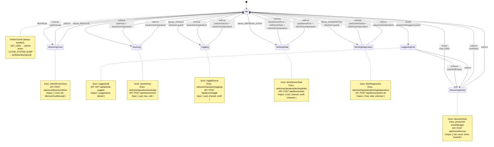

# devicesMachine State Chart Diagram



## Machine Context Structure

```typescript
type DevicesContext = {
  devices: MerossCloudDevice[]      // Cloud device list
  hosts: HostsMap                     // Discovered LAN hosts
  cidr: string                        // Network CIDR range
  deviceStates: Record<string, DeviceState>  // Per-device state cache
  systemDump: SystemDump | null       // Diagnostics data
  activeOperation: ActiveOperation    // Currently running operation
}
```

## Guards

| Guard | Purpose |
|-------|---------|
| `needsCidrSuggest` | Returns true if CIDR is empty/whitespace |
| `hasHost(uuid)` | Returns true if device has a known host in `hosts[uuid]` |
| `isActiveOperationFor(uuid, operationType)` | Returns true if operation is active for device |

## Actions

| Action | Purpose |
|--------|---------|
| `setDevices` | Update `devices` array from cloud |
| `setHosts` | Update `hosts` map from discovery |
| `setCidr` | Update `cidr` string |
| `setCidrIfEmpty` | Set CIDR only if current is empty |
| `persistCidr` | Save CIDR to localStorage |
| `setActiveOperation` | Mark operation as active for device |
| `clearActiveOperation` | Clear active operation flag |
| `setDeviceState` | Update state cache for device |
| `clearDeviceError` | Remove error from device state |
| `setDeviceError` | Set error message on device state |
| `setSystemDump` | Update system dump data |

## Events Reference

| Event | Payload | Target States |
|-------|----------|--------------|
| `REFRESH` | - | `refreshingCloud` |
| `SCAN` | - | `suggestingCidr` (if needs CIDR) or `discoveringHosts` |
| `SET_CIDR` | `{ cidr: string }` | Global (no transition) |
| `device_RESOLVE` | `{ uuid, mac, title }` | `resolving` |
| `device_TOGGLE` | `{ uuid, onoff: 0\|1 }` | `toggling` (if has host) |
| `device_REFRESH_STATE` | `{ uuid }` | `fetchingState` |
| `device_DIAGNOSTICS` | `{ uuid }` | `fetchingDiagnostics` (if has host) |
| `CLOSE_SYSTEM_DUMP` | - | Global (no transition) |
