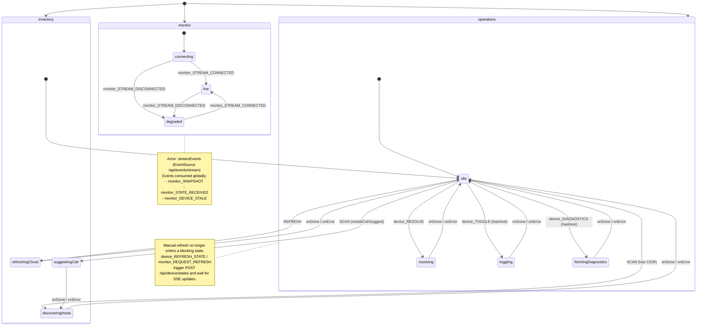

# devicesMachine State Chart Diagram



## Machine Context Structure

```typescript
type DevicesContext = {
  devices: MerossCloudDevice[]
  hosts: HostsMap
  cidr: string
  deviceStates: Record<string, DeviceState>
  systemDump: SystemDump | null
  activeDeviceUuid: string | null
  toggleRollback: { uuid: string; previous: DeviceState | null } | null
}
```

## Events Reference

| Event | Payload | Notes |
|-------|----------|-------|
| `REFRESH` | - | Refresh cloud inventory and hosts |
| `SCAN` | - | Discover LAN hosts |
| `SET_CIDR` | `{ cidr: string }` | Persists local + server CIDR |
| `device_RESOLVE` | `{ uuid, mac, title }` | Resolve host by MAC/scan |
| `device_TOGGLE` | `{ uuid, onoff: 0\|1 }` | Optimistic toggle + LAN command |
| `device_REFRESH_STATE` | `{ uuid }` | Immediate poll request (non-blocking) |
| `monitor_REQUEST_REFRESH` | `{ uuid }` | Same as manual refresh trigger |
| `monitor_SNAPSHOT` | `{ states }` | Initial SSE snapshot merge |
| `monitor_STATE_RECEIVED` | `{ state }` | Incremental SSE state update |
| `monitor_DEVICE_STALE` | `{ state }` | SSE stale/failure state update |
| `device_DIAGNOSTICS` | `{ uuid }` | Fetch `Appliance.System.All` dump |
| `CLOSE_SYSTEM_DUMP` | - | Clear diagnostics modal |
